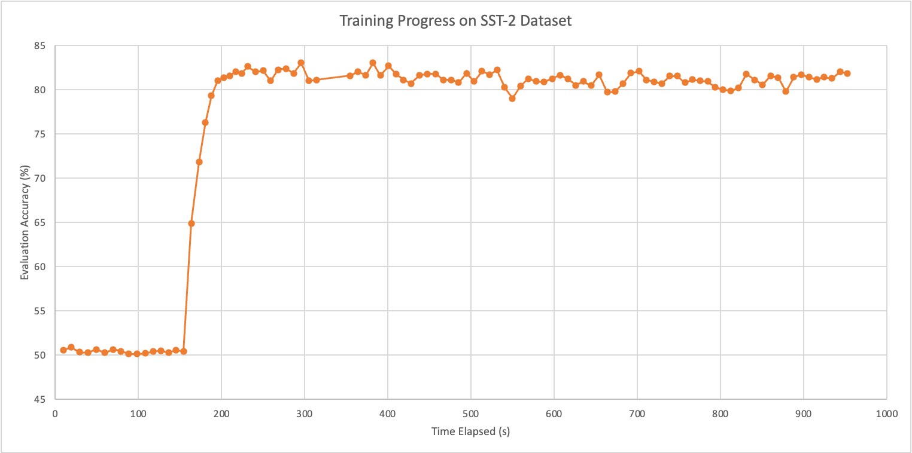

# CS 6741: Simple Recurrent Unit (SRU)

#### Question 1: What is the motivation for the approach, contextualized in contemporary models at the time (i.e., LSTMs)? And how does SRUs address the issues raised? 
- Before SRUs, most RNN models included recurrence calculations that requires **full** knowledge of the previous state: that is, one word must be **entirely** processed by the RNN cell before continuing to the next. This makes them very slow to train. 
- SRUs replace the full recurrent calculation with a light one that can be better parallelized for faster training speed. This is achieved by removing the computational dependency within each recurrence, i.e. calculations for each entry to the hidden state vector are independent in an SRU. 

#### Question 2: How does this motivation hold with more contemporary models, such as Transformers? 
- Not quite in the same way, but it still provides benefits in other aspects. 
- Models like Transformers address RNNs' slow training issue by removing the need to process inputs word by word. This makes them much faster to train as it allows for full-on parallelism; but as a negative side effect, it is less capable of deciphering sequential relationship between words (to a certain extent). 
- SRUs on the other hand are faster than regular RNNs, but thanks to its (light) recurrent connections, can still retain sequential information better than Transformers do. The authors of the SRU paper demonstrated that by incorporating SRUs into Transformers, performance can be improved even with less layers and comparable runtimes. 

#### Question 3: Technically, please summarize how SRU compares to LSTM, and why it computation costs are lower. 
- On a surface level, SRUs requires less computation-intensive matrix multiplications, similar to that of GRUs. 
- But there is another crucial difference between the SRU and the LSTM that allows the former to be much faster: the way hidden state vectors are "recurred" in the forget and reset gate. For these, SRUs use a recurrence of the form $\sigma(Wx + v \odot c+ b)$, in place of the usual $\sigma(Wx + Vc+ b)$ used by LSTMs. 
- The Hadamard product allows each entries to the state vector to be computable without needing to know the others. This makes asynchronous parallelization possible in a new dimension (as seen in algorithm 1 from the SRU paper); which cannot be done for LSTMs. This yields SRUs' lower computation costs against LSTMs. 

#### Question 4: Is SRU faster than LSTM during training because its overall complexity is lower, or are there additional reasons? Do these advantages hold in autoregressive inference (e.g., when generating from a language model)? 
- It is true that SRUs has less calculations than LSTM, but that is not the only reason why it is faster. As discussed in the previous question, SRUs can be asynchronously parallelized in terms of each hidden dimension, making it much faster. 
- These advantages should hold in terms of autoregressive inference, but potentially to a lesser extent. The parallelism in SRUs would still allow better usage of available computational hardware, but since all the entries to the last state vector are needed to perform inference, the advantage is less obvious (but should still be observable). 

#### Question 5: Report the results of your experiments. 
- In the `my_sru.py` file, I implemented a fully functional SRU model `SRU` that mimics the behavior of `torch.nn.LSTM` and `torch.nn.GRU`. I currently only had access to a laptop due to being abroad, so I was unable to confirm its behavior on CUDA-accelerated systems. 
- For the SST task, I built on top of a PyTorch implementation of Yoon Kim's "Convolutional Neural Networks for Sentence Classification" (see the `CNN-SC` folder). The same exact parameters were used as the paper, and I was able to achieve a test accuracy of 84.8% with a 2 layer SRU. It did run slower than the original paper, but that is expected as I am training on CPU only. The lower accuracy than the paper could be due to different preprocessing techniques used by the authors of this repository, to which I have no control over. 

- For the SQuAD task, I built on top of a streamlined version of DrQA, as mentioned in the original paper (see the `DrQA` folder). However due to my hardware constraint, I was only able to train the 3 layer model, as specified by the paper, for a few iterations. The best model had an EM rate of 49%, and F1 score of 60. This is not quite representative of the original paper, but unfortunately I cannot reproduce it due to the slow training progress with CPU only. 